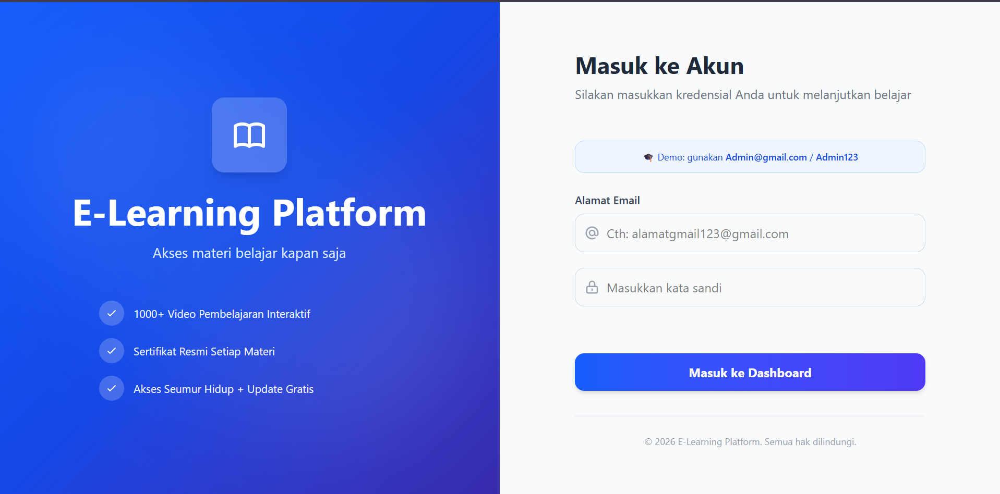
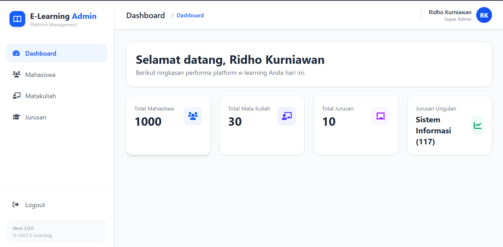

# 🎓 Sistem E-Learning Sederhana


Sebuah aplikasi sistem manajemen E-Learning sederhana berbasis web yang dibangun menggunakan **Laravel** dan **Tailwind CSS**. Aplikasi ini dirancang untuk memudahkan institusi pendidikan dalam mengelola data master akademik dengan antarmuka yang bersih dan modern. Sangat cocok dijadikan referensi atau landasan pengembangan Sistem Informasi Akademik yang lebih kompleks.

## 🚀 Fitur Utama

- **Sistem Otentikasi Aman**: Pengguna wajib melakukan login menggunakan kredensial yang valid sebelum dapat mengakses menu sistem.
- **Dashboard Informatif**: Halaman utama yang memberikan kontrol penuh setelah proses login berhasil.
- **Manajemen Data Mahasiswa**: Fitur pengelolaan (CRUD) lengkap untuk mencatat dan mengubah data mahasiswa secara efisien.
- **Manajemen Data Jurusan**: Memudahkan administrator untuk menambah, mengubah, dan menghapus daftar jurusan secara sistematis.
- **Manajemen Mata Kuliah**: Mengelola basis data kurikulum dan mata kuliah untuk memudahkan perencanaan sistem e-learning institusi.
- **UI/UX Interaktif & Responsif**: Antarmuka pengguna yang dirancang dengan Tailwind CSS serta dipercantik dengan umpan balik visual yang elegan dari SweetAlert2.

## 🛠️ Tech Stack

Aplikasi ini mengikuti best-practice pengembangan stack modern untuk memastikan performa yang cepat dan kemudahan struktur kode:

- **Backend Framework**: Laravel 13.x (PHP 8.3+)
- **Frontend Styling**: Tailwind CSS v4 & Vanilla JavaScript
- **Asset Bundler**: Vite v8
- **Database System**: MySQL / SQLite (Secara default mendukung migrasi sistem Eloquent Laravel)
- **Library Tambahan**: SweetAlert2 (untuk Notifikasi), Axios

## 💻 Cara Instalasi & Penggunaan Lokal

Ikuti langkah-langkah berikut untuk menjalankan repositori ini di perangkat lokal Anda.

### Prasyarat:
Pastikan Anda telah menginstal beberapa sistem inti berikut:
- PHP >= 8.3
- Composer
- Node.js & NPM
- MySQL

### Langkah Konfigurasi:

1. **Clone Repositori**
   Lakukan cloning proyek ke dalam mesin lokal Anda.
   ```bash
   git clone https://github.com/RidhoKurniawan-lab/Website-Elearning-Sederhana.git
   cd Website-Elearning-Sederhana
   ```

2. **Install Dependensi Backend**
   Unduh semua paket PHP yang dibutuhkan oleh Laravel.
   ```bash
   composer install
   ```

3. **Install Dependensi Frontend**
   Unduh paket styling dan bundler Node.js.
   ```bash
   npm install
   ```

4. **Persiapan Environment**
   Gandakan berkas konfigurasi environtment contoh menjadi berkas .env aktif.
   ```bash
   cp .env.example .env
   ```
   Lanjutkan dengan men-generate kode unik aplikasi (Application Key):
   ```bash
   php artisan key:generate
   ```

5. **Konfigurasi Database**
   Buka file `.env` dan atur informasi akses ke database lokal Anda.
   ```env
   DB_CONNECTION=mysql
   DB_HOST=127.0.0.1
   DB_PORT=3306
   DB_DATABASE=nama_database_elearning
   DB_USERNAME=root
   DB_PASSWORD=
   ```

6. **Jalankan Migrasi Database**
   Buat struktur tabel otomatis yang dibutuhkan aplikasi menggunakan fitur migration bawaan Laravel.
   ```bash
   php artisan migrate
   ```

7. **Kompilasi Aset Frontend**
   Bangun hasil styling Vite supaya UI aplikasi tampil secara sempurna.
   ```bash
   npm run build
   ```
   *(Catatan: Gunakan `npm run dev` apabila Anda berencana melakukan perubahan pada styling)*

8. **Jalankan Server Lokal**
   Nyalakan web server bawaan PHP.
   ```bash
   php artisan serve
   ```
   Aplikasi kini siap diakses melalui tautan **`http://localhost:8000`**.

## 📸 Tampilan Antarmuka (Screenshots)

Berikut adalah beberapa pratinjau antarmuka dari sistem E-Learning ini:

### 1. Halaman Login Otentikasi


### 2. Halaman Dashboard


### 3. Halaman Master Data Mahasiswa


### 4. Form Tambah Data Mahasiswa


### 5. Form Edit Data Mahasiswa


## 🧑‍💻 Penulis

Dikembangkan oleh **Ridho Kurniawan**. 
Proyek ini di-publish secara terbuka (Open Source) sebagai bentuk portofolio dan referensi bagi kawan-kawan developer (terutama pemula) yang ingin mendalami framework Laravel dan web development modern.

---

*Dibuat dengan ❤️ menggunakan Laravel. Jangan lupa untuk memberikan 🌟 (Star) pada repositori ini apabila kode ini membantu Anda dalam proses belajar!*
